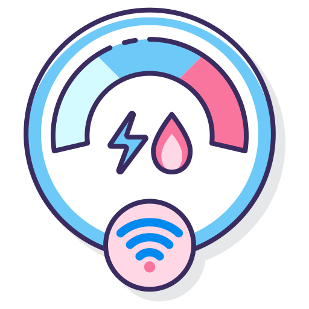

<p align="center">
  
</p>


<div align="center">
  <h1>Smart meter  Project</h1>
</div>

<p align="center">

 
   <a href="https://github.com/youssefboutaleb/Smart-meter-web3/forks" target="_blank">
    
  </a>

  <a href="https://github.com/youssefboutaleb/Smart-meter-web3/stargazers" target="_blank">
    
  </a>
<a href="https://github.com/youssefboutaleb/Smart-meter-web3/commits/main">
    
</a>

  <a href="https://github.com/youssefboutaleb/Smart-meter-web3/commits/main" target="_blank">
  
</a>


  <a href="https://github.com/youssefboutaleb/Smart-meter-web3/tree/main/issues" target="_blank">
    
  </a>

  <a href="https://github.com/youssefboutaleb/Smart-meter-web3/tree/main/pulls" target="_blank">
    
  </a>
  <a href="https://badge.fury.io/py/tensorflow" target="_blank">
    
  </a>

  <a href="https://github.com/youssefboutaleb/Smart-meter-web3/blob/main/LICENSE.md" target="_blank">
  
</a>

</p>


## Purpose


The Smart Meter Project aims to address common challenges faced by homeowners, businesses, and communities :

#### Security:
 We use blockchain as a secure and tamper-proof ledger to protect energy consumption data.

#### User Interface:
 We employ a dynamic web-based user interface for easy access and interaction with the system.

#### Scalability:
 Blockchain technology ensures scalability to handle a growing number of smart meters and transactions.

#### Transparency:
 The transparent nature of blockchain allows users to trace and verify energy consumption data.

#### Anomaly Detection: 
Our project integrates advanced algorithms to automatically identify unusual energy consumption patterns.

#### Data Integrity:
 Blockchain immutably records each reading to prevent data manipulation or fraud.

#### Cost-Efficiency:
 Decentralization reduces intermediaries and lowers operational costs.

#### Reliability:
 Blockchain guarantees continuous data collection even during disruptions.

#### Environmental Sustainability:
 We optimize energy consumption to support cleaner energy sources and sustainability efforts.
## How Predictive AI Models Address the Problem
#### ARIMA Model:
ARIMA, or Autoregressive Integrated Moving Average, is a widely-used time series forecasting method that combines autoregressive and moving average components. It's effective for capturing trends, seasonality, and autocorrelation in data, making it valuable for various forecasting applications.


#### Logistic Regression Model:
Logistic regression is a statistical model used for binary classification tasks. It calculates the probability of a binary outcome based on a set of independent variables.
##### dataset : [ausgrid](https://www.ausgrid.com.au/Industry/Our-Research/Data-to-share/Solar-home-electricity-data) 


## Overview

The Smart Meter Project is a web-based platform that empowers organizations and individuals to optimize their energy consumption, track it, detect anomalies (errors), and monitor consumption trends. This platform combines blockchain technology and predictive AI models to address real-world challenges in the field of energy management.

## Project Structure
<p align="center">
  <a href="https://flask.palletsprojects.com/">
    
  </a>
  <a href="https://dev.mysql.com/">
    
  </a>
  <a href="https://soliditylang.org/">
    
  </a>
</p>


The project is organized into the following components:

### Frontend: 
This encompasses the user interface of the site, comprising HTML, CSS, and JavaScript files that collectively ensure an engaging and interactive user experience.

### Backend: 
The backend is constructed with Flask, a Python web framework, to facilitate user interactions, execute smart contract calls, interact with the blockchain, and apply the integrated model for anomaly detection.
### AI Models:
We have incorporated two main  AI models into the project:
- ARIMA(AutoRegressive Integrated Moving Average): A time series forecasting method combining autoregressive and moving average components.
    
-  LR(Logistic Regression): A statistical technique for modeling relationships between variables.
### Smart Contract:
 The Solidity-coded smart contract manages secure data transactions and anomaly detection within the system.

### Database Management:
 The system utilizes MySQL for efficient and secure data storage, managing user information within the application## Run Locally


## Run it locally
To run the smart meter Project locally, follow these steps:

#### Clone the repository 

```bash
  git clone https://github.com/youssefboutaleb/Smart-meter-web3.git
```

#### Go to the project directory

```bash
  cd Smart-meter-web3
```

#### Set up a virtual environment and install the required Python packages 
 Create a Virtual Environment

```bash
  python -m venv <venv>
```
 Activate the Virtual Environment:
- On Windows:

```bash
.\<venv>\Scripts\activate
```
- On macOS and Linux:

```bash
source venv/bin/activate
```
#### Install Required Packages 


```bash
pip install -r requirements.txt
```
#### Configure the DataBase
- create the database :
 ```bash
mysql -u root -p
CREATE DATABASE crypto;
USE crypto;`
``` 
- Create the ' user ' table :
 ```bash
CREATE TABLE users (
  address VARCHAR(255) PRIMARY KEY,
  name VARCHAR(255) NOT NULL,
  username VARCHAR(255) NOT NULL,
  password VARCHAR(255) NOT NULL
);`
``` 
#### Run Ganache for Local Use
After installation, run Ganache with:
```bash
ganache-cli
``` 
##### Note :
1.  Change the HTTP provider: In the `app.py` file, update the Web3 HTTP provider to the appropriate local Ethereum node URL, if necessary.
2.  Deploy the Smart Contract: If the smart contract hasn't been deployed locally, you can use [remix](remix.ethereum.org/)
3.  Update the Contract Address: In the backend Python code (`sqlhelpers.py`), ensure that you've updated the contract address to match the address of your deployed smart contract.
    

By following these steps, you can ensure that the Smart Meter Project connects to your local Ethereum network and interacts with the correct smart contract address.

#### Start the server

```bash
  python app.py

```
#### Deactivate the Virtual Environment

When you're done working on the project, you can deactivate the virtual environment by running the following command:

```bash
deactivate
```
